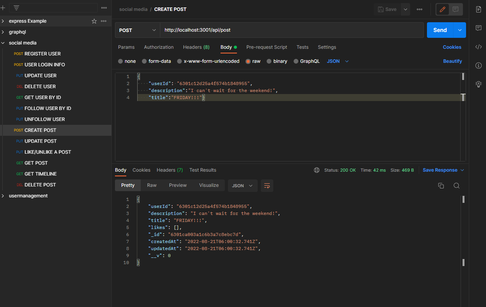

# Social Media API

# A Functioning social media api for managing users, likes and posts.

## USER STORY 📖

As the USER, I was a RESTful API to manage social media content.  
CRUD 💩 : I want to be able to add, update, and delete users, posts, and likes.
I want my data to be safe and secure by making sure my password is never stored in plain text.

## 📽️ Video Links

- [UserRoutes](https://drive.google.com/file/d/17kBBZbPD1rAnfNNvwUQgLDUH4W3IDaAJ/view)
- [FollowRoutes](https://drive.google.com/file/d/1ghdKuhKmUnHFE0naXq-u4LcCynFyt7cY/view)
- [PostRoutes](https://drive.google.com/file/d/1AWvK7gyiB6LDaTlbM2VK7EdpynieyND3/view)

## 🌟 Features

- Timeline view: see all of the posts from the users you follow
- like and dislike posts
- encrypting passwords
- integrate into your own social media appliation!

## 🔨🪛 Tools Used

- MongoDB🍃
- Mongoose 🦡
- Mockaroo🦘 (For seed data)
- Express ⚙️

### Challenges

Learning when I am in a database and when I am in javascript was challenging. To overcome it, I tried to use descriptive naming conventions. I also added helpful comments to make the code easier to understand as/after I built it.

## Features to Come 📢

- Full Front end
- Better Admin support
- More complex Timeline returns
